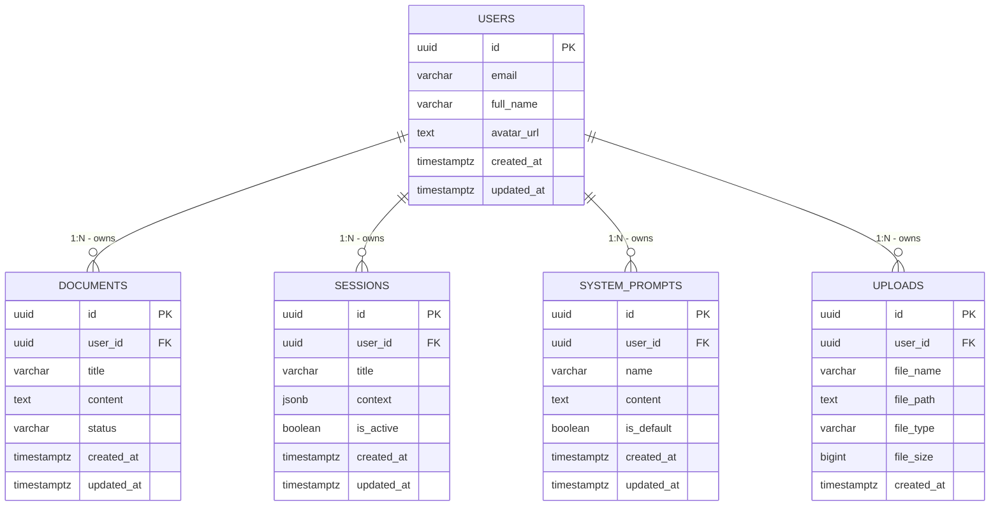

# Arquitectura de Base de Datos - Supabase

## Resumen

Este documento describe la arquitectura de la base de datos PostgreSQL en Supabase, incluyendo el esquema de tablas, relaciones entre entidades y las políticas de seguridad a nivel de fila (RLS) implementadas.

---

## Tablas

### 1. `users`

Almacena la información de perfil de los usuarios.

| Columna | Tipo | Nullable | Default | Descripción |
|---------|------|----------|---------|-------------|
| `id` | `uuid` | `false` | `auth.uid()` | Identificador único del usuario (relacionado con Auth de Supabase) |
| `email` | `varchar(255)` | `true` | `null` | Correo electrónico del usuario |
| `full_name` | `varchar(255)` | `true` | `null` | Nombre completo del usuario |
| `avatar_url` | `text` | `true` | `null` | URL del avatar del usuario |
| `created_at` | `timestamptz` | `true` | `now()` | Fecha de creación del registro |
| `updated_at` | `timestamptz` | `true` | `now()` | Fecha de última actualización |

**Primary Key:** `id`

---

### 2. `documents`

Almacena documentos creados por los usuarios.

| Columna | Tipo | Nullable | Default | Descripción |
|---------|------|----------|---------|-------------|
| `id` | `uuid` | `false` | `gen_random_uuid()` | Identificador único del documento |
| `user_id` | `uuid` | `false` | `null` | Referencia al usuario propietario |
| `title` | `varchar(255)` | `true` | `null` | Título del documento |
| `content` | `text` | `true` | `null` | Contenido del documento |
| `status` | `varchar(50)` | `true` | `'draft'` | Estado del documento (draft, published, archived) |
| `created_at` | `timestamptz` | `true` | `now()` | Fecha de creación |
| `updated_at` | `timestamptz` | `true` | `now()` | Fecha de última actualización |

**Primary Key:** `id`
**Foreign Key:** `user_id` → `users(id)`

---

### 3. `sessions`

Almacena sesiones o conversaciones activas de los usuarios.

| Columna | Tipo | Nullable | Default | Descripción |
|---------|------|----------|---------|-------------|
| `id` | `uuid` | `false` | `gen_random_uuid()` | Identificador único de la sesión |
| `user_id` | `uuid` | `false` | `null` | Referencia al usuario propietario |
| `title` | `varchar(255)` | `true` | `null` | Título o nombre de la sesión |
| `context` | `jsonb` | `true` | `null` | Contexto o metadata de la sesión en formato JSON |
| `is_active` | `boolean` | `true` | `true` | Indica si la sesión está activa |
| `created_at` | `timestamptz` | `true` | `now()` | Fecha de creación |
| `updated_at` | `timestamptz` | `true` | `now()` | Fecha de última actualización |

**Primary Key:** `id`
**Foreign Key:** `user_id` → `users(id)`

---

### 4. `system_prompts`

Almacena prompts del sistema personalizados por los usuarios.

| Columna | Tipo | Nullable | Default | Descripción |
|---------|------|----------|---------|-------------|
| `id` | `uuid` | `false` | `gen_random_uuid()` | Identificador único del prompt |
| `user_id` | `uuid` | `false` | `null` | Referencia al usuario propietario |
| `name` | `varchar(255)` | `true` | `null` | Nombre descriptivo del prompt |
| `content` | `text` | `true` | `null` | Contenido del prompt del sistema |
| `is_default` | `boolean` | `true` | `false` | Indica si es el prompt por defecto del usuario |
| `created_at` | `timestamptz` | `true` | `now()` | Fecha de creación |
| `updated_at` | `timestamptz` | `true` | `now()` | Fecha de última actualización |

**Primary Key:** `id`
**Foreign Key:** `user_id` → `users(id)`

---

### 5. `uploads`

Almacena información sobre archivos subidos por los usuarios.

| Columna | Tipo | Nullable | Default | Descripción |
|---------|------|----------|---------|-------------|
| `id` | `uuid` | `false` | `gen_random_uuid()` | Identificador único del upload |
| `user_id` | `uuid` | `false` | `null` | Referencia al usuario propietario |
| `file_name` | `varchar(255)` | `true` | `null` | Nombre original del archivo |
| `file_path` | `text` | `true` | `null` | Ruta de almacenamiento en Supabase Storage |
| `file_type` | `varchar(100)` | `true` | `null` | Tipo MIME del archivo |
| `file_size` | `bigint` | `true` | `null` | Tamaño del archivo en bytes |
| `created_at` | `timestamptz` | `true` | `now()` | Fecha de creación |

**Primary Key:** `id`
**Foreign Key:** `user_id` → `users(id)`

---

## Relaciones



### Resumen de Relaciones

| Tabla Origen | Tabla Destino | Tipo | Descripción |
|--------------|---------------|------|-------------|
| `users` | `documents` | **1:N** | Un usuario puede tener múltiples documentos |
| `users` | `sessions` | **1:N** | Un usuario puede tener múltiples sesiones |
| `users` | `system_prompts` | **1:N** | Un usuario puede tener múltiples prompts |
| `users` | `uploads` | **1:N** | Un usuario puede tener múltiples uploads |

---

## Políticas RLS (Row Level Security)

### Configuración General

Todas las tablas tienen **habilitadas las políticas RLS** y aplican el principio de **mínimo privilegio** donde cada usuario solo puede acceder a sus propios datos.

```sql
-- Habilitar RLS en todas las tablas
ALTER TABLE users ENABLE ROW LEVEL SECURITY;
ALTER TABLE documents ENABLE ROW LEVEL SECURITY;
ALTER TABLE sessions ENABLE ROW LEVEL SECURITY;
ALTER TABLE system_prompts ENABLE ROW LEVEL SECURITY;
ALTER TABLE uploads ENABLE ROW LEVEL SECURITY;
```

### 1. Políticas para `users`

| Nombre de la Política | Acción | Roles | Condición (USING) | Condición (WITH CHECK) |
|-----------------------|--------|-------|-------------------|------------------------|
| Users can insert own profile | `INSERT` | `public` | `null` | `(auth.uid() = id)` |
| Users can update own profile | `UPDATE` | `public` | `(auth.uid() = id)` | `null` |
| Users can view own profile | `SELECT` | `public` | `(auth.uid() = id)` | `null` |

```sql
-- Políticas RLS para users
CREATE POLICY "Users can insert own profile" ON users
  FOR INSERT TO public
  WITH CHECK (auth.uid() = id);

CREATE POLICY "Users can update own profile" ON users
  FOR UPDATE TO public
  USING (auth.uid() = id);

CREATE POLICY "Users can view own profile" ON users
  FOR SELECT TO public
  USING (auth.uid() = id);
```

**Nota:** No se permite `DELETE` en la tabla `users` desde el cliente. La eliminación de usuarios debe gestionarse a través del panel de administración o funciones de servidor.

---

### 2. Políticas para `documents`

| Nombre de la Política | Acción | Roles | Condición (USING) | Condición (WITH CHECK) |
|-----------------------|--------|-------|-------------------|------------------------|
| Users can view their own documents | `SELECT` | `public` | `(auth.uid() = user_id)` | `null` |
| Users can insert their own documents | `INSERT` | `public` | `null` | `(auth.uid() = user_id)` |
| Users can update their own documents | `UPDATE` | `public` | `(auth.uid() = user_id)` | `(auth.uid() = user_id)` |
| Users can delete their own documents | `DELETE` | `public` | `(auth.uid() = user_id)` | `null` |

```sql
-- Políticas RLS para documents
CREATE POLICY "Users can view their own documents" ON documents
  FOR SELECT TO public
  USING (auth.uid() = user_id);

CREATE POLICY "Users can insert their own documents" ON documents
  FOR INSERT TO public
  WITH CHECK (auth.uid() = user_id);

CREATE POLICY "Users can update their own documents" ON documents
  FOR UPDATE TO public
  USING (auth.uid() = user_id)
  WITH CHECK (auth.uid() = user_id);

CREATE POLICY "Users can delete their own documents" ON documents
  FOR DELETE TO public
  USING (auth.uid() = user_id);
```

---

### 3. Políticas para `sessions`

| Nombre de la Política | Acción | Roles | Condición (USING) | Condición (WITH CHECK) |
|-----------------------|--------|-------|-------------------|------------------------|
| Users can view own sessions | `SELECT` | `public` | `(auth.uid() = user_id)` | `null` |
| Users can create own sessions | `INSERT` | `public` | `null` | `(auth.uid() = user_id)` |
| Users can update own sessions | `UPDATE` | `public` | `(auth.uid() = user_id)` | `null` |
| Users can delete own sessions | `DELETE` | `public` | `(auth.uid() = user_id)` | `null` |

```sql
-- Políticas RLS para sessions
CREATE POLICY "Users can view own sessions" ON sessions
  FOR SELECT TO public
  USING (auth.uid() = user_id);

CREATE POLICY "Users can create own sessions" ON sessions
  FOR INSERT TO public
  WITH CHECK (auth.uid() = user_id);

CREATE POLICY "Users can update own sessions" ON sessions
  FOR UPDATE TO public
  USING (auth.uid() = user_id);

CREATE POLICY "Users can delete own sessions" ON sessions
  FOR DELETE TO public
  USING (auth.uid() = user_id);
```

---

### 4. Políticas para `system_prompts`

| Nombre de la Política | Acción | Roles | Condición (USING) | Condición (WITH CHECK) |
|-----------------------|--------|-------|-------------------|------------------------|
| Users can view their own system prompts | `SELECT` | `public` | `(auth.uid() = user_id)` | `null` |
| Users can insert their own system prompts | `INSERT` | `public` | `null` | `(auth.uid() = user_id)` |
| Users can update their own system prompts | `UPDATE` | `public` | `(auth.uid() = user_id)` | `(auth.uid() = user_id)` |
| Users can delete their own system prompts | `DELETE` | `public` | `(auth.uid() = user_id)` | `null` |

```sql
-- Políticas RLS para system_prompts
CREATE POLICY "Users can view their own system prompts" ON system_prompts
  FOR SELECT TO public
  USING (auth.uid() = user_id);

CREATE POLICY "Users can insert their own system prompts" ON system_prompts
  FOR INSERT TO public
  WITH CHECK (auth.uid() = user_id);

CREATE POLICY "Users can update their own system prompts" ON system_prompts
  FOR UPDATE TO public
  USING (auth.uid() = user_id)
  WITH CHECK (auth.uid() = user_id);

CREATE POLICY "Users can delete their own system prompts" ON system_prompts
  FOR DELETE TO public
  USING (auth.uid() = user_id);
```

---

### 5. Políticas para `uploads`

| Nombre de la Política | Acción | Roles | Condición (USING) | Condición (WITH CHECK) |
|-----------------------|--------|-------|-------------------|------------------------|
| Users can view own uploads | `SELECT` | `public` | `(auth.uid() = user_id)` | `null` |
| Users can create own uploads | `INSERT` | `public` | `null` | `(auth.uid() = user_id)` |
| Users can delete own uploads | `DELETE` | `public` | `(auth.uid() = user_id)` | `null` |

```sql
-- Políticas RLS para uploads
CREATE POLICY "Users can view own uploads" ON uploads
  FOR SELECT TO public
  USING (auth.uid() = user_id);

CREATE POLICY "Users can create own uploads" ON uploads
  FOR INSERT TO public
  WITH CHECK (auth.uid() = user_id);

CREATE POLICY "Users can delete own uploads" ON uploads
  FOR DELETE TO public
  USING (auth.uid() = user_id);
```

**Nota:** No se permite `UPDATE` en la tabla `uploads` desde el cliente. Los metadatos de archivos subidos son inmutables.

---

## Resumen de Acceso por Tabla

| Tabla | SELECT | INSERT | UPDATE | DELETE |
|-------|--------|--------|--------|--------|
| `users` | ✅ Propio | ✅ Propio | ✅ Propio | ❌ No permitido |
| `documents` | ✅ Propio | ✅ Propio | ✅ Propio | ✅ Propio |
| `sessions` | ✅ Propio | ✅ Propio | ✅ Propio | ✅ Propio |
| `system_prompts` | ✅ Propio | ✅ Propio | ✅ Propio | ✅ Propio |
| `uploads` | ✅ Propio | ✅ Propio | ❌ No permitido | ✅ Propio |

---

## Consideraciones de Seguridad

### 1. **Autenticación Requerida**
Todas las políticas utilizan `auth.uid()` lo que requiere que el usuario esté autenticado. Las solicitudes anónimas (sin JWT válido) no tendrán acceso a ningún dato.

### 2. **Aislación de Datos**
Cada usuario solo puede acceder a registros donde su `auth.uid()` coincida con:
- `users.id` (para la tabla de usuarios)
- `user_id` (para tablas de documentos, sesiones, prompts y uploads)

### 3. **Validación en Inserción (`WITH CHECK`)**
Las políticas de `INSERT` y algunas de `UPDATE` incluyen cláusula `WITH CHECK` para garantizar que:
- Los nuevos registros pertenezcan al usuario autenticado
- Las actualizaciones no transfieran la propiedad a otro usuario

### 4. **Operaciones Restringidas**
- **Tabla `users`:** No se permite eliminación desde el cliente para evitar inconsistencias con el sistema de autenticación de Supabase.
- **Tabla `uploads`:** No se permite actualización ya que los metadatos de archivos deben ser inmutables.

---

## Scripts de Implementación

### SQL Completo de Políticas RLS

```sql
-- ===========================================
-- HABILITAR RLS EN TODAS LAS TABLAS
-- ===========================================
ALTER TABLE users ENABLE ROW LEVEL SECURITY;
ALTER TABLE documents ENABLE ROW LEVEL SECURITY;
ALTER TABLE sessions ENABLE ROW LEVEL SECURITY;
ALTER TABLE system_prompts ENABLE ROW LEVEL SECURITY;
ALTER TABLE uploads ENABLE ROW LEVEL SECURITY;

-- ===========================================
-- POLÍTICAS PARA users
-- ===========================================
CREATE POLICY "Users can insert own profile" ON users
  FOR INSERT TO public
  WITH CHECK (auth.uid() = id);

CREATE POLICY "Users can update own profile" ON users
  FOR UPDATE TO public
  USING (auth.uid() = id);

CREATE POLICY "Users can view own profile" ON users
  FOR SELECT TO public
  USING (auth.uid() = id);

-- ===========================================
-- POLÍTICAS PARA documents
-- ===========================================
CREATE POLICY "Users can view their own documents" ON documents
  FOR SELECT TO public
  USING (auth.uid() = user_id);

CREATE POLICY "Users can insert their own documents" ON documents
  FOR INSERT TO public
  WITH CHECK (auth.uid() = user_id);

CREATE POLICY "Users can update their own documents" ON documents
  FOR UPDATE TO public
  USING (auth.uid() = user_id)
  WITH CHECK (auth.uid() = user_id);

CREATE POLICY "Users can delete their own documents" ON documents
  FOR DELETE TO public
  USING (auth.uid() = user_id);

-- ===========================================
-- POLÍTICAS PARA sessions
-- ===========================================
CREATE POLICY "Users can view own sessions" ON sessions
  FOR SELECT TO public
  USING (auth.uid() = user_id);

CREATE POLICY "Users can create own sessions" ON sessions
  FOR INSERT TO public
  WITH CHECK (auth.uid() = user_id);

CREATE POLICY "Users can update own sessions" ON sessions
  FOR UPDATE TO public
  USING (auth.uid() = user_id);

CREATE POLICY "Users can delete own sessions" ON sessions
  FOR DELETE TO public
  USING (auth.uid() = user_id);

-- ===========================================
-- POLÍTICAS PARA system_prompts
-- ===========================================
CREATE POLICY "Users can view their own system prompts" ON system_prompts
  FOR SELECT TO public
  USING (auth.uid() = user_id);

CREATE POLICY "Users can insert their own system prompts" ON system_prompts
  FOR INSERT TO public
  WITH CHECK (auth.uid() = user_id);

CREATE POLICY "Users can update their own system prompts" ON system_prompts
  FOR UPDATE TO public
  USING (auth.uid() = user_id)
  WITH CHECK (auth.uid() = user_id);

CREATE POLICY "Users can delete their own system prompts" ON system_prompts
  FOR DELETE TO public
  USING (auth.uid() = user_id);

-- ===========================================
-- POLÍTICAS PARA uploads
-- ===========================================
CREATE POLICY "Users can view own uploads" ON uploads
  FOR SELECT TO public
  USING (auth.uid() = user_id);

CREATE POLICY "Users can create own uploads" ON uploads
  FOR INSERT TO public
  WITH CHECK (auth.uid() = user_id);

CREATE POLICY "Users can delete own uploads" ON uploads
  FOR DELETE TO public
  USING (auth.uid() = user_id);
```

---

## Notas de Mantenimiento

- **Auditoría:** Considerar agregar tablas de auditoría si se requiere trazabilidad de cambios.
- **Índices:** Se recomienda crear índices en las columnas `user_id` de todas las tablas para optimizar las consultas con RLS.
- **Cascada:** Configurar `ON DELETE CASCADE` en las foreign keys para limpieza automática de datos cuando un usuario es eliminado.
- **Backup:** Las políticas RLS están incluidas en los backups de PostgreSQL, pero se recomienda versionar este documento.

---

*Documento generado el: 2026-05-04*
*Versión: 1.0*
